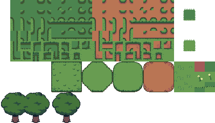

# 入站必读

## 什么是 GameMaker ？

GameMaker (前身为 GameMaker Studio 2) 是由 YoYo Games 运营的一款游戏引擎。

目前，GameMaker 有免费和订阅两种选择。

我们坚决反对盗版/破解 GM。您很可能会感染病毒，为了您的安全，请勿破解 GM。如果您必须使用该程序，请使用免费试用版。

> 请注意，GameMaker 的所有者 YoYo Games 已于 2021 年被 Opera 浏览器收购，目前正在进行重大改动。请坚持使用现代版引擎。

以下是一些 GameMaker 的教程：

- [官方手册](https://manual-static.gm-cn.top/)
- [长老湿的GML频道](https://space.bilibili.com/77454442/channel/seriesdetail?sid=1459918)
- [GameMaker Studio 2 上手指南](https://zhuanlan.zhihu.com/p/25762338)
- [GMS中文教程](https://zhuanlan.zhihu.com/p/21764954)

请注意，GameMaker Studio 1 与 GameMaker 是两个完全不同的程序，但两个程序的大部分代码逻辑是相同的。

(GameMaker Studio 2 是 GameMaker 的旧称。大多数在线资源都会用 GMS2 称呼它，因为它是最近才改的。本文档将使用 GM)

(New Runtime 更新有望成为GMS3)

## 编码约定

这里有一些来自 TML 的编码约定：

- 命名

    除["脚本"]和所有["变量"]名称外，其他资源均使用 "蛇式命名法"。

    > 蛇式命名法特点：名称中间的标点被替换成下划线（_）。
    
    为["内部变量"]添加"_"，这些变量不应在["对象"]之外被访问。

    > 例如：`_timer`

    使用 "大驼峰命名法"来命名["脚本"]和["函数"]。

    > 大驼峰命名法特点：名称中间没有空格和标点，所有单词首字母均大写。

- 引擎内置对象的变量

    这些变量不直接控制引擎内置对象的["内部变量"]（以 _ 开头）。

    > 例如：`battle._state;`

    请始终使用引擎提供的["函数"]。

    > 例如：`Battle_SetState();`

    公有变量（不以 _ 开头）可自由编写。

    > 例如：`battle_board.angle = value;`

- 回合准备

    应在 "battle_enemy"["对象"]中的 "Turn Preparation Start" ["对象事件"]中使用 "battle_turn"["对象"]。

    然后使用 "battle_turn"["对象"]中 "Preparation Start"["对象事件"]的["函数"]`Battle_SetTurnInfo(info, value)`"来设置回合属性。

    > 例如：`Battle_SetTurnInfo(BATTLE_TURN_INFO.BOARD_LEFT, 200);`

## 实例和免费资源

(请务必下载最新版本的引擎。在最新的 1.0 版之前，示例必须作为一个单独的项目下载)

- [示例项目](https://github.com/TML233/UndertaleEngine/tree/examples)

    内含 "GB攻击" 和 "简单战斗"。如果您打算在游戏中加入战斗，但仍在学习中，请下载此版本。

- [TML 的遗迹示例](https://github.com/starlightshore/UTE-Ruins-Demo-by-TML)

    遗迹示例是 TML 制作的一个项目，但源代码已经丢失。
    
    不过，我们找到了一个 .exe 文件。
    
    Starlightshore 使用 UndertaleModTool 反编译了 .exe 文件，并在 GameMaker 内重新制作了整个游戏。

    演示包含传说之下的前 5 个房间，但不包括 Flowey 的战斗。此演示仅用于学习如何使用 Undertale Engine。

- 可下载的瓦片示例

    看看这个！

    

    都是免费的：[点此下载](https://imgur.com/a/vqKOdFl)

## 许可证

这是为托比·福克斯（Toby Fox）的游戏 《传说之下》（UNDERTALE）设计的一款同人游戏引擎。

它是为 GameMaker（前身为 Gamemaker Studio 2）构建的，是一个免费项目，可供学习并在其中创建自己的同人游戏。

使用时，您必须注明 TML 为该引擎的创建者。该引擎以 MIT 许可发布，部分内容开源。

> 控制台系统是不开源的，但是我可以提供类似的替代源代码

UNDERTALE Engine 于 2019 年 5 月被废弃。

该项目在新主人 Jevilhumor 的带领下重新复活。

新的更新和示例正在计划和发布中。

文档已由 TML、Jevilhumor、Starlightshore 和 Hatty 制作完成。

所有游戏必须免费发布，不得以盈利为目的。

我们强烈建议其他人通过购买游戏或托比·福克斯的商品来支持传说之下和托比·福克斯，以示感谢。

我们无意成为原版游戏的替代品，我们都是为了娱乐和教育目的而创作粉丝作品。

在使用他人作品时，请务必注明出处并征得许可。您可以使用 The Spriters Resource (UT-DR) 来使用规范的精灵资产。

> 吐槽：Toby Fox 应该学一学 ZUN

## 工程备份

请学习和使用 [Github](https://github.com)。

当然，您可以通过将项目复制到一个新文件夹来备份您的工作。

不过，鉴于游戏文件损坏的复杂性，我们还建议您进行物理备份。

您可以复制游戏引擎文件夹并粘贴到一个新文件夹中，标注为 "备份（当前日期）"。

无论使用 2.2 还是 2.3，经常备份工作都是很好的做法，比如每当您尝试执行一项新任务时。

## GM vs. GMS 2.2. vs. GMS 2.3

自 2022 GameMaker Studio 2 已更名为 GameMaker。它将以此命名，简称为 GM。

它与 GMS 2 相同，唯一的区别是名称和品牌。

随着 GM 的变化，引擎将进一步过时。

如果您的项目是在 2.2 版本中制作的，而您希望迁移到 2.3 版本，请谨慎行事。

在升级过程中会出现一些破坏游戏的 BUG，而且 2.3 的总体状态也发生了变化。

它有很多小毛病（可能会损坏），而且没有 2.2 版那么精细。

为防止项目丢失，要么不要升级程序，要么遵循以下建议： 备份您的工作。

创建 2.3 版本的项目时，GameMaker Studio 2 会创建一个只能在 2.3 中打开的新项目文件。

您可能同时安装了 GameMaker Studio 2 的 2.2 和 2.3 版本。

转换应该可以完美运行，但如果您的项目无法按预期运行，您可能需要从 Github 重新下载。这种情况很少见，但也时有发生。

## 致谢名单

- Jevil:

    引擎目前的所有者。曾帮助 Starlightshore 完成文档。

- Hatty:

    创建了许多谷歌文档/文本文件来记录这个引擎。还为引擎贡献了代码。从 discord 改编为文档。

- TML:

    引擎的最初拥有者。已于 2019 年放弃该项目。撰写了文档中的部分页面。不过，TML 仍活跃在 discord 上，部分新文本已被改编到文档中。

- Starlightshore:

    2021 年编写了大部分文档。